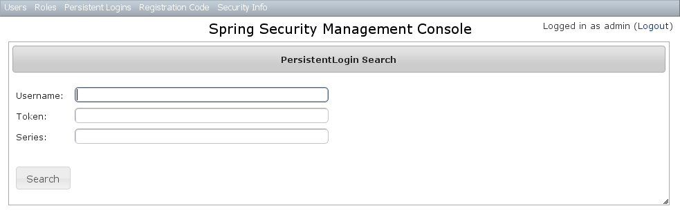
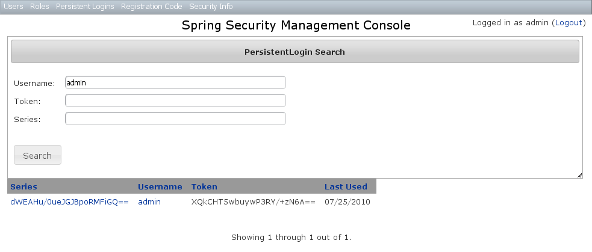
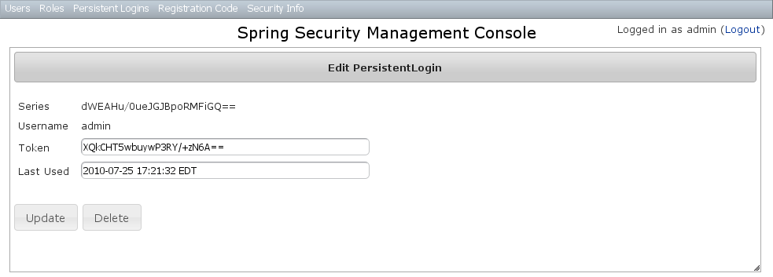

////
Licensed to the Apache Software Foundation (ASF) under one
or more contributor license agreements.  See the NOTICE file
distributed with this work for additional information
regarding copyright ownership.  The ASF licenses this file
to you under the Apache License, Version 2.0 (the
"License"); you may not use this file except in compliance
with the License.  You may obtain a copy of the License at

https://www.apache.org/licenses/LICENSE-2.0

Unless required by applicable law or agreed to in writing,
software distributed under the License is distributed on an
"AS IS" BASIS, WITHOUT WARRANTIES OR CONDITIONS OF ANY
KIND, either express or implied.  See the License for the
specific language governing permissions and limitations
under the License.
////

[[persistentCookie]]
== Persistent Cookie Management

Persistent cookies aren't enabled by default - you must enable them by running the `s2-create-persistent-token` script. See the https://apache.github.io/grails-spring-security/latest/index.html#rememberMeCookie[Spring Security Core Plugin documentation] for details about this feature.

The Persistent Logins menu is only shown if this feature is enabled.

=== Persistent logins search

The default action for the PersistentLogin controller is search. By default only the standard fields (`username`, `token`, and `series`) are available but this is customizable with the <<s2ui-override>> script - see the <<customization>> section for details.

You can search by any combination of fields, and all fields have an Ajax autocomplete to assist in finding instances. Leave all fields empty to return all instances.

Searching is case-insensitive and the search string can appear anywhere in the field. Results are shown paginated in groups of 10 and you can click on any header to sort by that field:

=== Persistent logins edit

After clicking through to an instance you get to the edit page (there are no view pages):

You can update the `token` or `lastUsed` attribute or delete the instance.

=== Persistent logins creation

Since instances are created during authentication by the spring-security-core plugin, there is no functionality in this plugin to create new instances.
